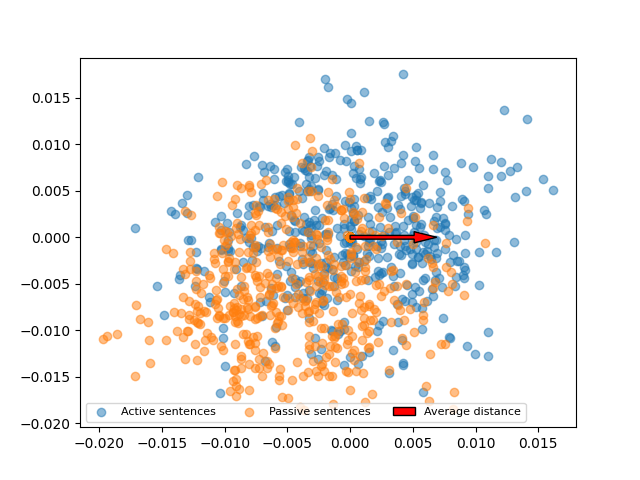
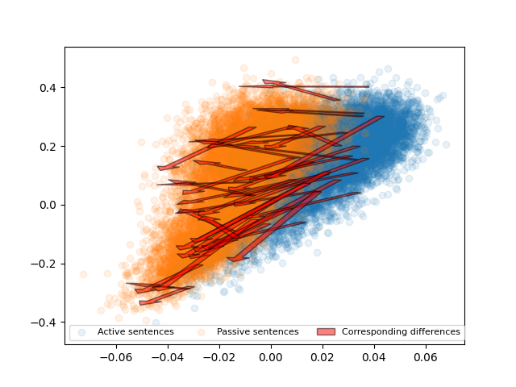
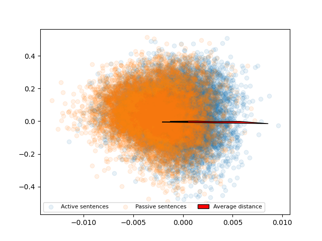
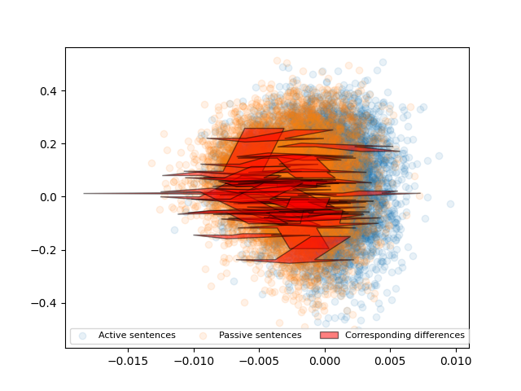

# sentence-arithmetic

## Data generation:

1. Put .txt files in data/raw (can be in subfolders)

2. Run data/generate_dataset.py

3. New active/sentence pairs will be appended to data/processed/active_passive.tsv

## Data analysis on simple example sentences

1. Run generator.py

2. Run embedding.py

3. Do your own stuff with the sentence embeddings

## Active-passive simple sentences results (by Daniel)

1. Run generator.py, embedding.py to generate the necessary data
2. Run PCA_alternative.py, make sure that the line emb = get_sentence_embeddings('data/simple_example_sentences_embedding.npy')#[:,:10000,:] is not commented out. This loads the simple example sentences. This generates the images results/img/active_passive_simple_sentences_individual_arrows_visualisation.png and active_passive_simple_sentences_visualisation.png:
   
   
   
## Active-passive real life sentences results (by Daniel)

1. Unzip the file data/processed/active_passive.tsv.zip in the same folder
2. Run PCA_alternative.py, make sure that the line emb = get_sentence_embeddings('../data/processed/active_passive_embedding.npy')[:,:10000,:] is not commented out. This loads the real life example sentences. This generates the images results/img/active_passive_real_life_sentences_visualisation.png and active_passive_real_life_sentences_individual_arrows_visualisation.png:
   
   
   
## Testing if the (active sentence)-(passive sentence) is roughly the same for all sentences

1. Unzip the file `data/processed/active_passive.tsv.zip` in the same folder
2. Run `jumble_sentences.py`. This generates `active_passive_jumbled.tsv`.
3. Run `embedding.py` and make sure the lines 
 `compute_active_passive_literature_embeddings()` and 
 `compute_active_passive_literature_jumbled_embeddings()`
are not commented out. This generates the files `active_passive_embedding.npy` and `active_passive_jumbled_embedding.npy`.
4. `Run nearest_embedding_experiment.py`. This generates the following output:
```
Experiment 1: Original passive-Original active
Now computing for how many sentences A_i+avgerage_diff is closest to B_i:
100%|██████████| 9977/9977 [43:43<00:00,  3.80it/s]
For 9945/9977 (99.68%) sentences A_i+avgerage_diff is closest to B_i.
------------------
Experiment 2: Original passive-Jumbled active
  0%|          | 0/9977 [00:00<?, ?it/s]Now computing for how many sentences A_i+avgerage_diff is closest to B_i:
100%|██████████| 9977/9977 [43:55<00:00,  3.79it/s]
For 9844/9977 (98.67%) sentences A_i+avgerage_diff is closest to B_i.
------------------
Experiment 3: Original passive-Jumbled passive
Now computing for how many sentences A_i+avgerage_diff is closest to B_i:
100%|██████████| 9977/9977 [43:42<00:00,  3.80it/s]
For 9886/9977 (99.09%) sentences A_i+avgerage_diff is closest to B_i.
```

Explanation of output:
in experiment 1, we have set {A1, A2, ..., A9977} of passive voice sentences and the set of {B1, B2, ..., B9977} of corresponding active voice sentences. I.e., A1 and B1 have the same meaning, just one is in active voice, one is in passive voice. average_diff is the average of B_i-A_i for i=1,...,9977. It is then checked if B1 is the sentence closest to the vector A1+average_diff, and if B2 is the sentence closest to the vector A2+average_diff, and similarly up to A9977+average_diff and B9977. This is the case for 9945/9977 of sentences. 

Experiments 2 and 3 are analogues of this, were the set {A1, A2, ..., A9977} is the same, but the set {B1, B2, ..., B9977} is different. In experiment 2, the latter set is jumbled active voice sentences, in experiment 3, the latter set is jumbled passive voice sentences.

Interpretation of results:
the success rate is highest if {B1, B2, ..., B9977} are the corresponding passive voice vectors. This is evidence for the fact that the average_diff does not just detect the removal of the word "by", but contains the a style difference of sentences.