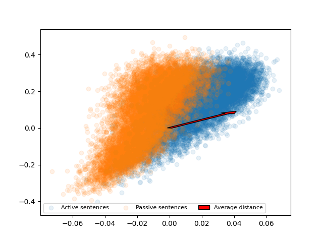

# sentence-arithmetic

## Data generation:

1. Put .txt files in data/raw (can be in subfolders)

2. Run data/generate_dataset.py

3. New active/sentence pairs will be appended to data/processed/active_passive.tsv

## Data analysis on simple example sentences

1. Run generator.py

2. Run embedding.py

3. Do your own stuff with the sentence embeddings

## Active-passive simple sentences results (by Daniel)

1. Run generator.py, embedding.py to generate the necessary data
2. Run PCA_alternative.py to generate the images results/img/active_passive_simple_sentences_individual_arrows_visualisation.png and active_passive_simple_sentences_visualisation.png:
   
   
   